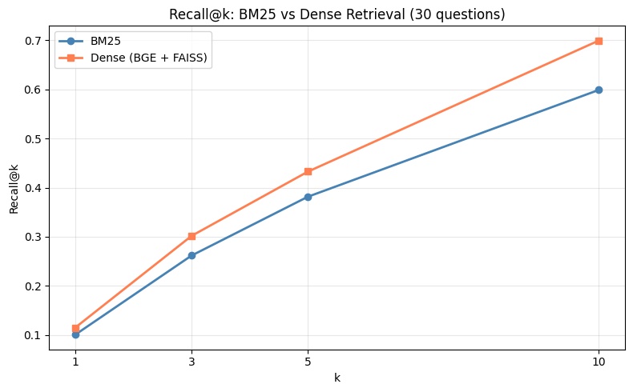
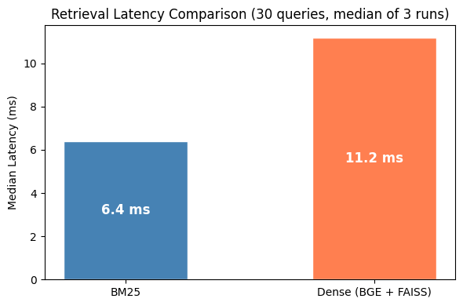
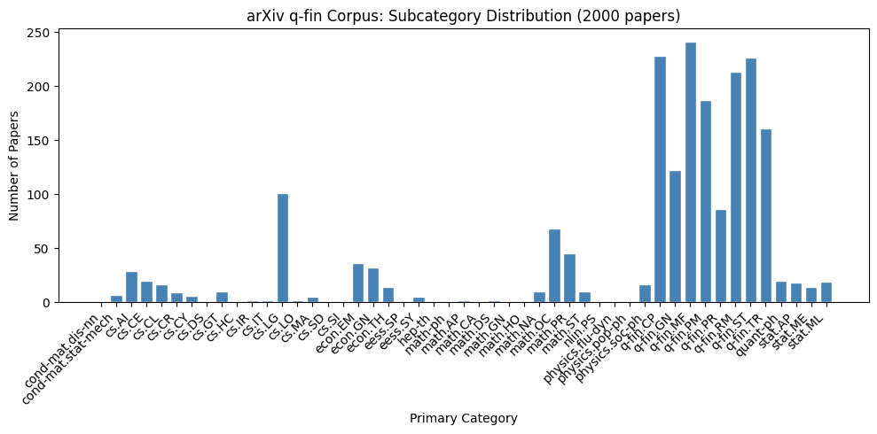

# Quant Finance RAG

A retrieval-augmented generation system for answering questions over 2000 recent arXiv quantitative finance papers. Built end-to-end with open-source components, evaluated on retrieval quality and answer faithfulness.



## Why

LLMs are strong on general knowledge but weak on niche, fast-moving domains. Quantitative finance is one of those domains. New papers come out daily on stochastic volatility, RL for portfolio allocation, market microstructure, and any model trained six months ago has not seen them. RAG is the standard way to handle this. This project builds the full pipeline end to end on a real domain and measures how each component performs.

## What it does

A question goes in. The system retrieves the 5 most relevant paper abstracts from the corpus and generates a grounded answer that cites the papers used.

Example query: *"What is Value at Risk and how is it estimated?"*

The system retrieves five papers including "Reliable Real-Time Value at Risk Estimation via Quantile Regression Forest with Conformal Calibration" and "Lambda Expected Shortfall," then generates an answer that names the first paper and describes its specific approach. The output distinguishes which papers in the retrieved set directly address estimation vs which are more theoretical.

## How it works

```
┌──────────────────────────────────────────────────────────────────┐
│                                                                  │
│  2000 arXiv q-fin papers                                         │
│  (Semantic Scholar API, all 9 q-fin subcategories)               │
│                                                                  │
└────────────────────┬─────────────────────────────────────────────┘
                     │
                     ▼
        ┌────────────────────────┐
        │ Chunk (500w / 50 ovl)  │   one chunk per paper
        │ title + abstract       │   (max abstract = 303 words)
        └────────────┬───────────┘
                     │
       ┌─────────────┴─────────────┐
       ▼                           ▼
┌──────────────┐           ┌────────────────────┐
│  BM25 index  │           │  BGE embeddings    │
│ (rank_bm25)  │           │  + FAISS IndexFlatIP│
└──────┬───────┘           └─────────┬──────────┘
       │                             │
       └──────────────┬──────────────┘
                      ▼
           ┌────────────────────────┐
           │ Top-5 retrieved chunks │
           └───────────┬────────────┘
                       ▼
           ┌────────────────────────┐
           │ Qwen2.5-7B-Instruct    │   "answer only from
           │ (fallback from Llama)  │    retrieved abstracts,
           │                        │    cite paper titles"
           └───────────┬────────────┘
                       ▼
                  Final answer
```

## Stack

| Component | Choice | Why |
|---|---|---|
| Corpus source | Semantic Scholar API, ArXiv venue | Same papers as arXiv API, better rate limits |
| Chunking | 500-word window, 50-word overlap | Abstracts average 161 words, every paper fits in one chunk |
| Sparse retrieval | `rank_bm25.BM25Okapi` | Fast keyword baseline, deliberately simple |
| Dense retrieval | `BAAI/bge-small-en-v1.5` + FAISS `IndexFlatIP` | 384-dim embeddings, L2-normalized so inner product = cosine |
| Generator | `Qwen/Qwen2.5-7B-Instruct` | Llama-3.1-8B was gated, Qwen is the open-weights equivalent |
| Evaluation | Recall@k, MRR, LLM-as-judge faithfulness, manual spot-check | Standard IR metrics + a check that the generator actually uses the context |

## Results

Evaluated on 30 hand-crafted questions covering pricing, risk, portfolio management, statistical finance, computational finance, market microstructure, and macro. Relevance labels: 510 (question, chunk) pairs hand-labeled by me.

### Retrieval

| Metric | BM25 | Dense (BGE + FAISS) |
|---|---|---|
| Recall@1 | 0.1008 | 0.1152 |
| Recall@5 | 0.3816 | 0.4327 |
| Recall@10 | 0.5989 | 0.6994 |
| MRR | 0.8667 | 0.9159 |
| Median latency / query | **6.4 ms** | 11.2 ms |

Dense retrieval beats BM25 at every cutoff. The gap is largest at Recall@10 where dense pulls in roughly 10 percentage points more relevant chunks. MRR is high for both, which means the first relevant document usually appears near the top of the ranking.

Qualitatively, dense wins on conceptual queries where the question wording differs from the paper. BM25 holds up on exact-term queries like "GARCH" or "Black-Scholes."



### Faithfulness

For each of the 30 generated answers, I passed the answer plus the source abstracts back to the same Qwen model and asked it to label the answer FAITHFUL or UNFAITHFUL. The judge prompt defines faithfulness as every factual claim being supported by at least one of the abstracts.

- **17 out of 30 marked faithful (56.7%)**
- Manual spot-check on 10 examples (5 from each bucket): 10/10 agreement with the judge

The most common failure mode was the generator paraphrasing beyond the source. The model would say a method "outperforms baselines" when the abstract only said "shows competitive results." Another pattern: the generator citing one paper's title but attributing a finding from a different paper in the retrieved set. These are the kinds of errors that look authoritative and only surface when you read the sources alongside the answer.

This is the interesting result. Retrieval is largely a solved problem with off-the-shelf tools. Faithfulness in domain-specific RAG is not. Strict prompting helps but does not eliminate it.

## Corpus



2000 papers spanning March 2025 to May 2026, all 9 q-fin subcategories. Mathematical Finance is the largest at 241 papers, followed by Computational, Statistical, and Risk Management. Meaningful cross-listing tail into cs.LG and math.OC.

## Repo structure

```
quant-finance-rag/
├── README.md              # this file
├── notebook.ipynb         # main notebook, runs end to end on Colab A100
├── data/
│   ├── qfin_papers.json           # 2000 papers, fetched once via Semantic Scholar
│   ├── relevance_judgments.csv    # 510 hand-labeled (question, chunk) pairs
│   └── faithfulness_spotcheck.csv # 10 spot-check decisions
├── figs/
│   ├── corpus_categories.png
│   ├── recall_at_k.png
│   └── retrieval_latency.png
└── outputs/
    ├── rag_outputs.jsonl          # 30 generated answers + retrieved chunks
    └── retrieval_results.jsonl    # top-10 per (question, retriever) at k=10
```

## Running it

1. Open `notebook.ipynb` in Google Colab. Switch runtime to A100 GPU, enable High-RAM.
2. Upload the three files in `data/` to the Colab working directory.
3. Run cells in order. Section 4 derives chunks from `qfin_papers.json`. Sections 5-6 build retrievers. Section 8 loads the generator. Sections 9-10 run evaluation.

Dependencies install in the first cell: `pandas`, `matplotlib`, `seaborn`, `tqdm`, `rank_bm25`, `sentence-transformers`, `faiss-cpu`, `transformers`, `accelerate`.

## Limitations

This is a research prototype, not a production system or financial decision tool.

- **Coverage:** corpus is the 2000 most recent papers. Biased toward recent research, not foundational works. Questions about Black-Scholes or Markowitz retrieve recent papers that mention those topics, not the original works.
- **Hallucination:** roughly four in ten answers contain a claim not strictly supported by the retrieved abstracts. Always verify against the source paper.
- **Evaluation set:** 30 questions, single annotator. Numbers show the right pattern but are not definitive measurements.
- **Abstracts only:** the corpus is titles and abstracts, not full text. Questions requiring implementation-level detail will hit a wall.

## What I'd do next

- **Hybrid retrieval.** BM25 and dense find different kinds of relevant documents. Reciprocal rank fusion would likely improve Recall@10.
- **Full paper text.** Abstracts are limiting. Adding the body text and figures would unlock harder questions but requires PDF parsing and significantly more storage.
- **Domain-tuned embeddings.** Fine-tuning BGE on q-fin papers should improve dense retrieval on the conceptual queries where it already shows an edge.
- **Faithfulness as a training signal.** The 56.7% rate suggests there's signal to be had from training the generator (or a reranker) explicitly on faithfulness preferences.

## Context

Built as part of independent learning on the intersection of LLMs and quantitative finance. I work in electronic trading and was curious how far off-the-shelf RAG could go on real domain-specific research questions.

If you're working on similar problems in fixed income, derivatives, or systematic trading, I'd be interested to compare notes.
